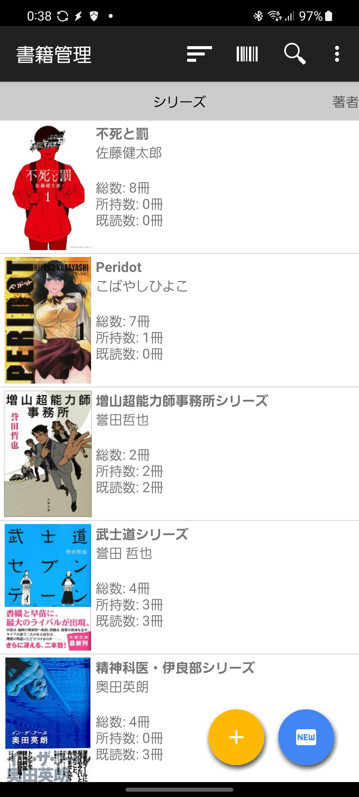
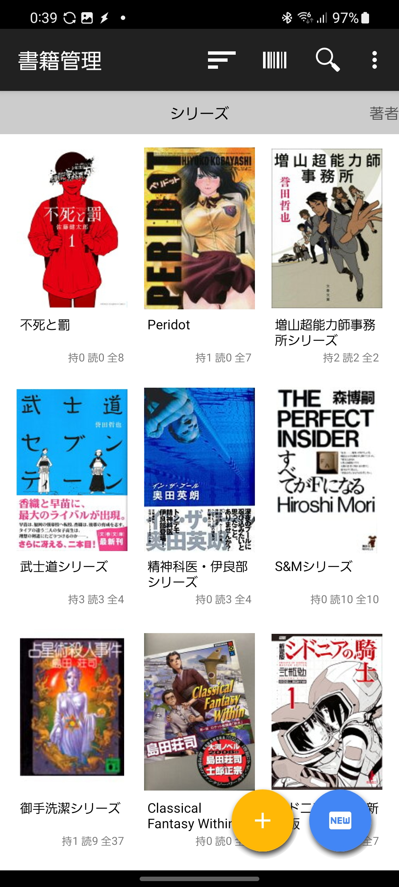

## 目次
- [一般](#一般)
  - [表示形式](#表示形式)
    - [通常(default)](#通常default)
    - [コンパクト](#コンパクト)
  - [画像品質](#画像品質)
    - [高品質](#高品質)
    - [Wifi接続時のみ高品質(default)](#wifi接続時のみ高品質default)
    - [低品質](#低品質)
  - [新刊リスト期間](#新刊リスト期間)
    - [すべての期間](#すべての期間)
    - [先月から3か月後まで](#先月から3か月後まで)
    - [先月から2か月後まで](#先月から2か月後まで)
    - [先月から来月まで](#先月から来月まで)
    - [先月から1週間後まで(default)](#先月から1週間後までdefault)
  - [履歴保存期間](#履歴保存期間)
    - [90日](#90日)
    - [60日](#60日)
    - [30日(default)](#30日default)
    - [10日](#10日)
    - [7日](#7日)
    - [3日](#3日)
- [詳細](#詳細)
    - [書籍API](#書籍api)
        - [楽天(default)](#楽天default)
        - [Google](#google)
        - [国立国会図書館サーチ](#国立国会図書館サーチ)
        - [Yahoo!ショッピング](#yahooshopping)
        - [JANCODE LOOKUP](#jancode-lookup)
        - [Open Library](#open-library)
    - [新刊チェックAPI](#新刊チェックapi)
        - [書籍管理専用サーバ(default)](#書籍管理専用サーバdefault)
        - [楽天](#楽天)
        - [Google](#google-1)
        - [国立国会図書館サーチ](#国立国会図書館サーチ-1)
    - [サジェストAPI](#サジェストapi)
        - [書籍管理専用サーバ(default)](#書籍管理専用サーバdefault-1)
        - [Google](#google-2)
    - [新刊チェック方法](#新刊チェック方法)
        - [手動実行](#手動実行)
        - [自動実行(default)](#自動実行default)
    - [新着登録期間](#新着登録期間)
        - [すべての期間(default)](#すべての期間default)
        - [今月以降](#今月以降)
        - [先月以降](#先月以降)
        - [先々月以降](#先々月以降)
    - [日本語限定](#日本語限定)
- [ツール](#ツール)
    - [空のシリーズ・著者を削除する](#空のシリーズ著者を削除する)
    - [未使用の書影画像を削除する](#未使用の書影画像を削除する)
- [バックアップ/リストア](#バックアップリストア)
    - [バックアップ](#バックアップ)
    - [リストア](#リストア)

## 一般

### 表示形式

シリーズ・著者・書籍のリスト表示で「通常」と「コンパクト」の２種類の表示形式を選択できます。

#### 通常(default)

一行で画像と詳細情報を表示します。

{:style="max-width: 300px;"}

#### コンパクト

一行に画像と簡易情報を複数ならべて表示します。

{:style="max-width: 300px;"}

### 画像品質

#### 高品質

設定している画像の品質をそのまま表示します。

#### Wifi接続時のみ高品質(default)

Wi-Fi接続時のみ高品質の設定で採用します。  
4Gや5Gなどのモバイル回線では、低品質の設定で表示します。 

#### 低品質

設定している画像の品質を落として表示します。   
対象は楽天やGoogleなど一部のデータソースの画像しか対応していません。  
画像をリサイズするのではなく、URLを品質に応じて書き換える実装です。

### 新刊リスト期間

新刊リストに表示する期間を設定します。  
新刊リストに表示する書籍は、期間の他に、次の条件のいずれかを満たす必要があります。

- シリーズに登録されている書籍
- 新刊チェック対象となっている著者の書籍

#### すべての期間
期間の絞り込みは行いません。  
シリーズまたは新刊チェック対象の著者の書籍はすべて表示します。

#### 先月から3か月後まで
先月の1日から、3か月後の月末までの期間を表示します。

#### 先月から2か月後まで
先月の1日から、2か月後の月末までの期間を表示します。

#### 先月から来月まで
先月の1日から、来月の月末までの期間を表示します。

#### 先月から1週間後まで(default)
先月の1日から、1週間後までの期間を表示します。

### 履歴保存期間

メイン画面の「履歴」に表示するアプリの様々な操作履歴を保存する期間を設定します。  
新刊のチェックのタイミングで古い履歴を削除します。

#### 90日
90日より古い履歴は削除されます。

#### 60日
60日より古い履歴は削除されます。

#### 30日(default)
30日より古い履歴は削除されます。

#### 10日
10日より古い履歴は削除されます。

#### 7日
7日より古い履歴は削除されます。

#### 3日
3日より古い履歴は削除されます。

## 詳細

### 書籍API

インターネット検索と個別の書籍の詳細情報を取得するAPIを指定します。

#### 楽天(default)
楽天ブックスのAPIを使用します。  

ISBNが付加されている書籍の情報源としては、最も優秀だと思います。   
ISBNだけではなく、若干の表記の揺らぎはありますが、タイトルや著者名などの属性情報も豊富です。

書影画像も豊富です。  
また書影画像は解像度を指定して取得できるため、「一般」設定の「画像品質」で選択に応じて、適切な解像度の画像を取得できます。

#### Google
Google BooksのAPIを使用します。  

インターネット検索の結果は電子書籍の情報が優先的に返却されます。  
そのため、ISBNに紐づけて保存できる情報は少ないです。  
電子書籍の場合は、ISBNの代わりにg:で始まるGoogle Books固有のIDを使用します。  
一方で個別の書籍をISBNをキーにして検索する場合は、目的の書籍情報が取得にほぼ成功します。

インターネット検索の際に、全体の結果数が予想値であるため、実際に返却される数を大幅に少ないことがあります。  
その結果、検索結果のリストの下の方が空白になってしまうことがあります。  
今後のアプリの改善点の一つです。

書影画像は豊富です。  
また書影画像は解像度も6段階用意されているため、「一般」設定の「画像品質」で選択に応じて、適切な解像度の画像を取得できます。

#### 国立国会図書館サーチ
国立国会図書館サーチのAPIを使用します。

情報が取得できる書籍数は多いと思います。  
しかし、ISBNを始めとして書籍の属性情報が少ないような気がします。  

書影画像は少ないような気がします。  
もしかしたらリクエスト過多で画像の取得に失敗しているだけかもしれません。  
画像の解像度は一通りしかないため、「一般」設定の「画像品質」を選択しても影響はありません。

#### Yahoo!ショッピング
Yahoo!ショッピングの商品検索APIを使用します。

Yahoo!ショッピングで出店しているオンライン書店から情報を取得するため、検索結果に同じ書籍が複数表示されることがあります。  
書籍の属性情報は、出店している書店ごとに異なるため、正規化するのは難しいです。  
ただしISBNに関してはJANコードとして専用の属性が用意されているため取得は容易です。  
全ての書店の情報を取得すると、書籍の重複も多いし、属性情報の正規化が破綻するため、いくつか書店を絞って検索しています。

書影画像は出品している書店に依存しますが、豊富な方だと思います。  
ただし画像の縦横比が正方形だったり、解像度とURLの対応が分かりにくい気がします。  
しかしながら解像度の数は多いため、「一般」設定の「画像品質」で選択に応じて、適切な解像度の画像を表示するように試みます。

#### JANCODE LOOKUP
JANCODE LOOKUPのAPIを使用します。

JANCODE LOOKUPは、JANコードが振られた商品を取得するAPIであるため、検索結果に書籍以外の商品も含まれます。  
書籍の場合はJANコードの代わりにISBNが取得できます。  
検索でヒットする書籍数は多いと思います。  
また書籍の属性情報は少ないですが形式が統一されており扱いやすいです。  

書影画像は豊富です。  
画像はどこか他のデータソースから取得しているような気がしますが、わかりません。  
画像の解像度は2段階あるため、一応「一般」設定の「画像品質」で選択に応じて、解像度を切り替えるようにしています。

#### Open Library
Open LibraryのAPIを使用します。

Open Libraryは、海外のサービスであるため、日本の書籍の情報は少ないです。  
書籍の属性情報は日本語だったりローマ字だったりするので扱いづらいでが、属性データは構造化されているためISBNなどの取得は容易です。

書影画像も用意されていますが、書籍情報自体が少ないため、書影画像が多いのか少ないのか判断できません。  
書影画像の解像度は数段階用意されているため、「一般」設定の「画像品質」で選択に応じて、適切な解像度に切り替えます。

### 新刊チェックAPI

#### 書籍管理専用サーバ(default)
書籍管理専用サーバを使用します。  
書籍管理専用サーバでは、あらかじめ新刊に関する情報を収集しておき、アプリに返却するため応答が速いです。  
新刊の情報を収集する先は楽天APIです。

#### 楽天
楽天ブックスのAPIを使用します。  
複数回リクエストを行う必要があるため、応答が遅くなります。  
あまり使用していないため、正常に動くか不明なので、おすすめしません。

#### Google
Google BooksのAPIを使用します。  
複数回リクエストを行う必要があるため、応答が遅くなります。  
あまり使用していないため、正常に動くか不明なので、おすすめしません。

#### 国立国会図書館サーチ
国立国会図書館サーチのAPIを使用します。  
複数回リクエストを行う必要があるため、応答が遅くなります。  
あまり使用していないため、正常に動くか不明なので、おすすめしません。

### サジェストAPI

#### 書籍管理専用サーバ(default)
書籍管理専用サーバを使用します。  
サーバサイドでGoogle Suggest APIと楽天APIを使用して、サジェスト候補を取得します。  

#### Google
Google Suggest APIを使用します。  
正式なAPIではないようで、いつか使えなくなる可能性があります。

### 新刊チェック方法

#### 手動実行
メニューの「新刊チェック」から新刊チェックを手動で実行します。  
あまり使用していないため、動作が不安定かもしれません。

#### 自動実行(default)
アプリを起動したタイミングに1日1回、新刊チェックを自動で実行します。

### 新着登録期間
新刊チェックで、発売日が指定した期間内の書籍のみ、新刊として登録します。

#### すべての期間(default)
書籍の発売日には関係なく、すべての書籍を登録します。

#### 今月以降
今月の1日以降の書籍のみ登録します。

#### 先月以降
先月の1日以降の書籍のみ登録します。

#### 先々月以降
先々月の1日以降の書籍のみ登録します。

### 日本語限定
有効にすると、新刊チェックでISBNが日本で発行された書籍のみ登録します。

## ツール

### 空のシリーズ・著者を削除する
書籍がひとつも登録されていないシリーズと著者を削除します。  
ただしシリーズは新刊チェックが有効な場合は削除されません。

### 未使用の書影画像を削除する
書影に設定した画像がゴミとして残っている場合に削除します。  
書影に端末内の画像を設定する際に、アプリに画像をコピーするため、ゴミになることがあります。  
そもそもゴミが出ないようにするか、自動で掃除されるようにすることが今後課題です。  
バックアップにゴミごと保存されるため、バックアップ前に削除すると良いでしょう。

## バックアップ/リストア

アプリで登録した書籍情報や既読・所有の状態などのデータのバックアップとリストアができます。
端末の画像を設定した場合も、コピーを作成してバックアップに含めるため、リストア後に画像が表示されます。  
おすすめのバックアップ先は、Google Driveです。

### バックアップ
書籍のデータをバックアップします。  
バックアップファイルはファイラーやGoogle Driveに保存します。

### リストア
書籍のデータをリストアします。  
端末内やGoogle Driveから保存したバックアップファイルを選択してリストアします。  
